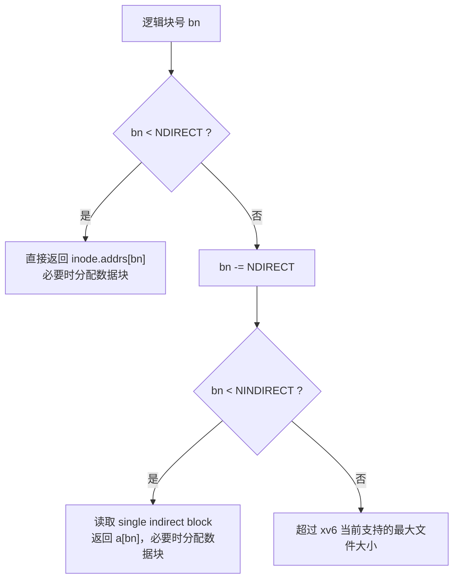

# Lab 4 xv6 文件系统扩展实验

> 本实验基于 **xv6-riscv**。你将围绕“文件系统如何在磁盘上组织数据、如何通过目录项找到 inode、如何让一个 inode 具备更丰富的语义”完成 4 个功能扩展：**Large Files、Symbolic Links、Long Filenames、Hard Link & unlink 语义**。  
>
> 你需要特别注意：这是“持久化存储”方向实验，要求不仅通过测试，更要保证数据结构在磁盘上的一致性。例如，新增的间接块必须能正确释放；目录项扩展必须不破坏路径解析；unlink 语义必须符合 Unix 的生命周期规则。
>
> 本实验截止日期：2025.12.28（两周）

---

## 你需要准备什么

你开始写代码之前，建议先把这些文件通读一遍。不用全背下来，但要知道它们各自负责什么：

- `kernel/fs.h`：文件系统常量、inode/dirent 在磁盘上的布局（非常关键）。
- `kernel/fs.c`：路径解析、目录操作、`bmap()`、`itrunc()` 等核心逻辑。
- `kernel/sysfile.c`：`open/link/unlink` 等系统调用实现（这也是你写 symlink/hardlink 语义的主战场）。
- `kernel/log.c`、`kernel/bio.c`：本实验不要求你改日志与缓存，但你写文件系统时会间接依赖它们。
- `user/`：用户态测试程序放在这里（你会在本实验里新增测试）。

---

## 实验 1：Large Files

### 1.1 现状：xv6 现在怎样把“文件内容”映射到磁盘块？

在 xv6 中，一个文件对应一个 inode。inode 里不存文件内容本身，而是存“指向数据块的地址”。这件事由 `bmap()` 负责：给定一个文件内的逻辑块号 `bn`（第几个数据块），`bmap()` 返回磁盘上的物理块号（block number），必要时还会 **按需分配** 新的数据块。

当前 xv6 的 inode 地址结构是经典的：

- **direct blocks（直接块）**：inode 里直接放若干个数据块号，访问快。
- **single indirect block（一级间接块）**：inode 里再放一个“间接块”的块号，这个间接块本身是一个块号数组，每一项指向一个数据块。

因此，当前 `bmap()` 的核心流程可以用下面的流程图概括：



这会导致一个直接的限制：**最大文件大小被固定在 (NDIRECT + NINDIRECT) × BSIZE**。你要做的就是把这个上限显著提高。

---

### 1.2 任务：引入 double indirect blocks

你的目标是让 inode 支持：

- direct blocks
- single indirect block
- **double indirect block（二级间接块）**

double indirect 的含义是：inode 保存一个块号 `DIND`，它指向“一级表”；一级表的每个条目再指向一个“二级表”；二级表的每个条目才指向真正的数据块。

你需要完成的修改大致集中在这些地方（请按你的仓库结构调整文件名，但逻辑不变）：

- 你必须修改 `kernel/fs.h` 中与 inode 地址布局相关的定义（例如 `NDIRECT`，以及 `struct dinode` 的 `addrs[]` 长度与含义），为 **double indirect 指针** 预留一个槽位。
- 你必须修改 `kernel/fs.c` 中的 `bmap()`：当 `bn` 落在 double indirect 的范围时，能够正确地访问/分配一级表与二级表，并最终返回数据块号。
- 你必须修改 `kernel/fs.c` 中的 `itrunc()`：当文件被删除或截断时，必须正确释放：
  - direct 指向的数据块；
  - single indirect 指向的所有数据块以及该 indirect block；
  - **double indirect 指向的所有二级表、所有数据块以及一级表本身**。
- 如果你的课程仓库中 `mkfs`（例如 `mkfs/mkfs.c`）依赖 `MAXFILE` 等常量，那么你需要同步更新它，避免“文件系统实现支持，但镜像生成工具不支持”的不一致。

实现时你需要坚持一个原则：**按需分配**。你不应该在创建文件时就分配所有表块；只有当文件增长到对应区间时才分配中间表。

---

### 1.3 测试方法：如何验证你真的支持了大文件？

如果你的仓库带有类似 MIT 6.S081 的测试（例如 `bigfile` / `usertests`），你可以直接跑它们；否则，你必须补一个“写到远超 single indirect 上限”的测试。

下面给出一个最小可用的用户态测试程序。它会创建一个文件并写入大量块（你可以根据你设置的 `NDIRECT` 调整写入次数），目标是确保写入会落入 double indirect 区间。

```c
// user/bigwrite.c
#include "kernel/types.h"
#include "kernel/stat.h"
#include "user/user.h"
#include "kernel/fcntl.h"

int
main(void)
{
  int fd = open("big", O_CREATE | O_WRONLY);
  if (fd < 0) {
    printf("bigwrite: open failed\n");
    exit(1);
  }

  static char buf[1024];
  for (int i = 0; i < 3000; i++) {
    if (write(fd, buf, sizeof(buf)) != sizeof(buf)) {
      printf("bigwrite: write failed at i=%d\n", i);
      exit(1);
    }
  }

  close(fd);
  printf("bigwrite: ok\n");
  exit(0);
}
```

把它加入构建系统（通常是 `Makefile` 或 `UPROGS`），然后在 xv6 里运行 `bigwrite`。正确的表现是：程序正常结束、系统不 panic、文件大小明显超过 single indirect 能覆盖的范围。

---

### 1.4 可选扩展（Bonus）

如果你想进一步挑战自己，可以尝试：

- 支持 triple indirect（三级间接），并在文档中写清楚你如何计算最大文件大小。
- 在 `bmap()` 中加入更严格的边界检查与错误处理（例如当 `bn` 超过最大范围时返回错误而不是 panic，和 Linux 的结果对齐）。

---

## 实验 2：Symbolic Links

### 2.1 现状：xv6 的路径解析为什么“不会跳转”？

目前 xv6 的路径解析（通常在 `namei()` / `nameiparent()` / `namex()` 一类函数中）逻辑大致是：

- 从根目录或当前目录开始；
- 按 `/` 分割路径；
- 每一步在“当前目录”中做一次目录项查找（`dirlookup`）；
- 找到 inode 后继续下一段；
- 最终得到路径对应的 inode。

关键点是：**解析过程中不会遇到“把某个路径段替换成另一段路径”的机制**。这意味着 xv6 原生并不支持 symbolic link。

---

### 2.2 任务：实现 `symlink(target, path)` 并让 `open()` 支持跟随

符号链接的核心语义是：**它是一个特殊类型的文件，文件内容存放的是 target 路径字符串**。

你需要完成三个事情：

1) 你必须引入一个新的 inode 类型（例如 `T_SYMLINK`）。这通常会涉及 `kernel/stat.h` 或类似文件中类型常量的扩展。

2) 你必须实现一个系统调用 `symlink(target, path)`：
- 在 `path` 位置创建一个类型为 `T_SYMLINK` 的 inode；
- 把 `target` 字符串写入该 inode 的数据区（通常用 `writei()`，并建议把末尾 `'\0'` 一起写进去，便于读取）；
- 注意：即使 `target` 不存在，也必须允许创建 symlink（这叫“悬空链接”，是真实 Unix 的行为）。

3) 你必须修改 `open()` 的语义（一般在 `kernel/sysfile.c` 的 `sys_open`）：
- 当 `open` 得到的 inode 类型是 `T_SYMLINK` 时，你需要读取其内容得到 target；
- 如果 `open` 没有带 `O_NOFOLLOW`，你必须用 target 作为新的路径继续解析；
- 为了避免 `a -> b -> a` 这种循环，你必须限制最大跟随深度（常见是 10），超过就返回错误；
- 如果带了 `O_NOFOLLOW`，那么 `open` 应该打开的是 symlink 本身，而不是 target。

提示：你通常还需要在 `kernel/fcntl.h` 中定义一个新的 open 标志位 `O_NOFOLLOW`（选一个未占用的 bit）。

---

### 2.3 测试方法：你应该覆盖哪些行为？

你至少应该让测试覆盖下面四种行为（这四种是最容易写错的）：

- 基本功能：`symlink("real", "link")` 后，`open("link")` 能读到 `real` 的内容。
- 悬空链接：`symlink("no_such", "dangling")` 能成功创建，但 `open("dangling")` 失败。
- 循环链接：`a -> b, b -> a` 时，`open("a")` 必须失败（不能死循环，也不能卡住）。
- `O_NOFOLLOW`：`open("link", O_NOFOLLOW)` 应该返回 symlink 自身（通常读 symlink 的内容可看到 target 字符串）。

下面提供一个最小测试程序（你可以把它拆成多个子 case，也可以把循环链接 case 单独写一个 test）：

```c
// user/symlinktest.c
#include "kernel/types.h"
#include "kernel/stat.h"
#include "user/user.h"
#include "kernel/fcntl.h"

static void
basic(void)
{
  int fd = open("real", O_CREATE | O_WRONLY);
  if (fd < 0) { printf("symlinktest: open real failed\n"); exit(1); }
  write(fd, "hello", 5);
  close(fd);

  if (symlink("real", "link") < 0) { printf("symlinktest: symlink failed\n"); exit(1); }

  fd = open("link", O_RDONLY);
  if (fd < 0) { printf("symlinktest: open link failed\n"); exit(1); }
  char buf[6] = {0};
  read(fd, buf, 5);
  close(fd);

  if (strcmp(buf, "hello") != 0) {
    printf("symlinktest: expect hello, got %s\n", buf);
    exit(1);
  }
}

static void
dangling(void)
{
  if (symlink("no_such_target", "dangling") < 0) {
    printf("symlinktest: dangling create failed\n");
    exit(1);
  }
  int fd = open("dangling", O_RDONLY);
  if (fd >= 0) {
    printf("symlinktest: dangling open should fail\n");
    close(fd);
    exit(1);
  }
}

int
main(void)
{
  basic();
  dangling();
  printf("symlinktest: ok\n");
  exit(0);
}
```

---

### 2.4 可选扩展（Bonus）

如果你希望做得更完整，可以扩展：

- 实现 `readlink(path, buf, size)` 系统调用（直接读取 target 字符串但不跟随）。
- 支持相对路径 symlink 的更精确语义（需要仔细处理“相对路径是相对谁”的问题）。

---

## 实验 3：Long Filenames

### 3.1 现状：为什么 xv6 的文件名长度是固定的？

目录在 xv6 中本质是一个普通文件，内容由一串固定大小的目录项组成：

```c
struct dirent {
  ushort inum;
  char name[DIRSIZ];  // DIRSIZ 通常是 14
};
```

这让目录操作变得很简单（查找就是顺序扫描），但也导致一个硬限制：**文件名必须 <= DIRSIZ**。

你要做的是在尽量不推翻 xv6 整体模型的前提下，让目录项能表示更长的名字。

---

### 3.2 任务：用“多槽目录项”编码长文件名

推荐你使用“多槽（multiple slots）”方案：当文件名较长时，用多个连续的 `dirent` 存储名字片段，最后一个 `dirent` 才保存真正的 inode 号。

你可以采用如下编码约定（这只是一个推荐，你也可以设计自己的，但必须写清楚并保持一致）：

- `de.inum == 0` 表示空槽（xv6 原有约定）。
- `de.inum == 0xFFFF` 表示“长名续槽”，`de.name[]` 里存一段文件名片段。
- 最后的“主槽” `de.inum == 真正 inode号`，它的 `de.name[0]` 可以置为 `0` 或某个特殊标记，用来表示该项是长名的主槽（便于调试）。

你需要重点修改以下函数（通常都在 `kernel/fs.c`）：

- 你需要在创建目录项时，修改（或新增）`dirlink`，让它能够为长名分配连续槽位，并写入续槽与主槽。
- 你需要在查找目录项时，修改（或新增）`dirlookup`，让它能够识别续槽，重组出完整长文件名，并与目标 name 比较。
- 你必须保证 `unlink` 删除目录项时能正确清理所有槽位（否则目录里会残留“孤儿续槽”，后续查找会出现诡异行为）。

强烈建议你把“短名逻辑”和“长名逻辑”分成两个分支：短名依旧走原先的单槽逻辑，这样更稳、也更容易通过已有测试。

---

### 3.3 测试方法：你需要验证哪些边界情况？

你需要至少验证这些行为：

- 能创建并打开长度明显大于 `DIRSIZ` 的文件名（例如 40~60 字符），并能正常读写内容。
- 同一目录下短名与长名混合存在时，查找/遍历不会出错。
- 对长名文件做 `unlink` 后，目录中不应残留导致冲突的续槽；随后创建另一个长名也应正常。
- 超过你定义的最大长度（例如 60/64/128）时必须返回错误。

下面给出一个简单测试程序：

```c
// user/longnametest.c
#include "kernel/types.h"
#include "kernel/stat.h"
#include "user/user.h"
#include "kernel/fcntl.h"

int
main(void)
{
  char name[] = "this_is_a_very_very_long_filename_for_xv6_test_0123456789";
  int fd = open(name, O_CREATE | O_WRONLY);
  if (fd < 0) {
    printf("longnametest: open failed\n");
    exit(1);
  }
  write(fd, "ok", 2);
  close(fd);

  fd = open(name, O_RDONLY);
  if (fd < 0) {
    printf("longnametest: reopen failed\n");
    exit(1);
  }
  char buf[3] = {0};
  read(fd, buf, 2);
  close(fd);

  if (strcmp(buf, "ok") != 0) {
    printf("longnametest: content mismatch %s\n", buf);
    exit(1);
  }

  if (unlink(name) < 0) {
    printf("longnametest: unlink failed\n");
    exit(1);
  }

  printf("longnametest: ok\n");
  exit(0);
}
```

---

### 3.4 可选扩展（Bonus）

如果你想把目录做得更像真实系统，可以考虑：

- 在删除文件后对目录做“压缩/整理”，避免大量空槽导致目录膨胀。
- 为目录实现更快的查找结构（例如 hash/btree），并在文档中解释你为什么这样做（这通常是加分项）。

---

## 实验 4：Hard Link & unlink

### 4.1 现状：xv6 中“一个文件的生命周期”靠什么决定？

在 Unix 语义里，一个文件是否“真正被删除”，并不取决于你执行了几次 `unlink`，而取决于两个条件是否同时满足：

1) **目录项引用计数 `nlink == 0`**：已经没有任何名字指向这个 inode；  
2) **内存引用也归零**：没有进程还持有这个 inode（通常意味着所有打开它的 fd 都已经关闭）。

xv6 的 inode 里通常有 `nlink` 字段（磁盘持久化），同时内存中的 inode 有引用计数（不一定叫同名字段）。你需要保证这两套计数协同工作，才能实现正确语义。

---

### 4.2 任务：实现 `link(old, new)` 并保证 `unlink` 语义正确

你需要实现（或补全）系统调用 `link(old, new)`：

- 你必须解析 `old` 得到 inode `ip`（注意：通常不允许对目录做 hard link）。
- 你必须解析 `new` 的父目录 inode `dp` 与最后一段名字 `name`。
- 你必须在 `dp` 中新增一个目录项 `name -> ip->inum`。
- 你必须把 `ip->nlink++` 并持久化更新（`iupdate`）。

然后你需要保证 `unlink(path)` 的语义完整：

- `unlink` 本质上只删除“一个名字”（一个目录项），所以你应该：
  - 在父目录中把对应的 dirent 清零；
  - 把 inode 的 `nlink--` 并持久化；
- 当 `nlink` 变为 0 时并不意味着立刻释放数据块（因为文件可能还被打开）。
- 真正释放应发生在最后一次 `iput()` 之后（也就是 inode 的内存引用归零的那一刻），这通常会触发 `itrunc()` 释放数据块并回收 inode。

这部分实现主要集中在：

- `kernel/sysfile.c`：`sys_link`、`sys_unlink`（以及你可能要读的 `sys_open`）。
- `kernel/fs.c`：目录查找/插入函数（如果你做了 Long Filenames，这里也会被复用）。

---

### 4.3 测试方法：你必须验证“删了名字但文件仍可用”

最经典、也最容易暴露 bug 的测试是：

- 打开文件得到一个 fd；
- 创建硬链接 `b` 指向同一个 inode；
- 删除原名 `a`；
- 继续通过 fd 写入；
- 关闭 fd；
- 再通过 `b` 读回写入内容。

如果你的实现正确，文件在 `a` 被删掉后仍然存在（因为 `b` 还指向它，而且 fd 还打开着），并且写入不会丢失。

下面是最小测试：

```c
// user/hardlinktest.c
#include "kernel/types.h"
#include "kernel/stat.h"
#include "user/user.h"
#include "kernel/fcntl.h"

int
main(void)
{
  int fd = open("a", O_CREATE | O_WRONLY);
  if (fd < 0) { printf("hardlinktest: open a failed\n"); exit(1); }

  if (write(fd, "x", 1) != 1) { printf("hardlinktest: write x failed\n"); exit(1); }

  if (link("a", "b") < 0) { printf("hardlinktest: link failed\n"); exit(1); }
  if (unlink("a") < 0) { printf("hardlinktest: unlink a failed\n"); exit(1); }

  if (write(fd, "y", 1) != 1) { printf("hardlinktest: write y failed\n"); exit(1); }
  close(fd);

  fd = open("b", O_RDONLY);
  if (fd < 0) { printf("hardlinktest: open b failed\n"); exit(1); }

  char buf[3] = {0};
  if (read(fd, buf, 2) != 2) { printf("hardlinktest: read failed\n"); exit(1); }
  close(fd);

  if (strcmp(buf, "xy") != 0) {
    printf("hardlinktest: expect xy got %s\n", buf);
    exit(1);
  }

  if (unlink("b") < 0) { printf("hardlinktest: unlink b failed\n"); exit(1); }

  printf("hardlinktest: ok\n");
  exit(0);
}
```

---

### 4.4 可选扩展（Bonus）

你可以进一步实现或解释：

- 为什么通常禁止对目录创建 hard link（会破坏目录树结构，甚至造成循环）。
- 在 `ls -l` 的输出里显示 `nlink` 并让你能直观看到链接数量变化（作为可视化辅助）。

---

## 交付要求（你需要提交什么）

你需要提交：

1) 修改后的 xv6 源码（建议用 git 提交，并在提交信息中标注每个功能点）。  
2) 你新增的测试程序（放在 `user/`，并保证已加入构建）。  
3) 一份简短的实现说明（`doc/impl.md` 或类似），用自然语言解释：
   - 你如何扩展 inode/dirent 的磁盘布局；
   - 你在哪些函数中改了哪些关键逻辑；
   - 你如何证明实现正确（跑了哪些测试、覆盖了哪些 corner cases）。

截止日期：2025.12.28（两周）

---

## 常见坑（请在调试时优先排查）

- Large Files：只改 `bmap()` 不改 `itrunc()`，会导致磁盘块泄漏；或者 double indirect 的索引计算写错，导致写到错误块。
- Symbolic Links：没有限制跟随深度，会在循环链接时卡死；或者 `O_NOFOLLOW` 被忽略，导致测试语义不符合预期。
- Long Filenames：unlink 时没有清理续槽，会导致目录变脏；dirlookup 重组名字时忘了补 `'\0'`，会出现诡异比较错误。
- Hard Link：`nlink` 更新忘记持久化（没 `iupdate`），会导致重启后语义错乱；或者误把“删除名字”等同于“立即释放数据”。

祝你实现顺利。只要你能把这四个功能做正确，你对“文件系统持久化数据结构”的理解就已经非常接近真实系统了。
