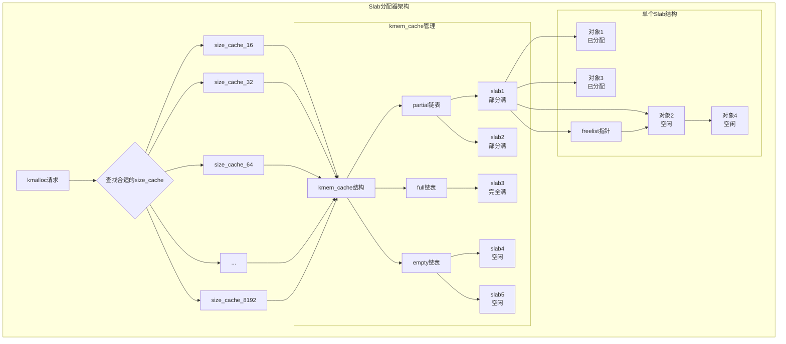
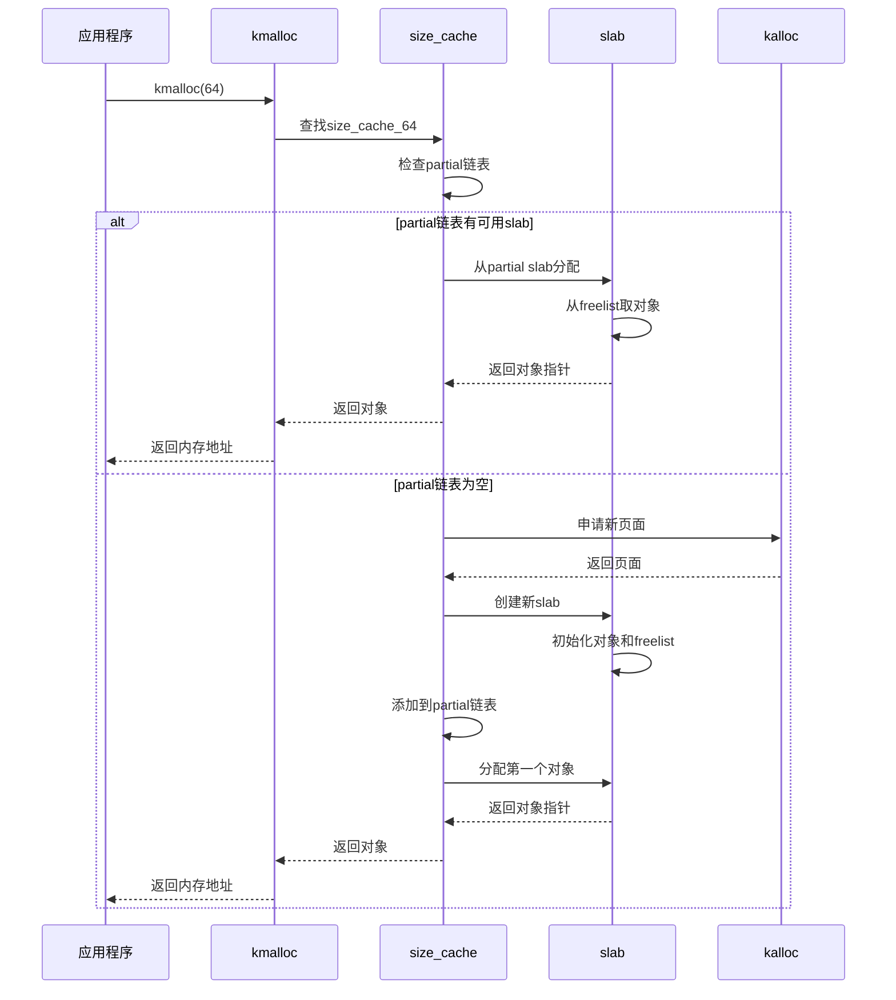
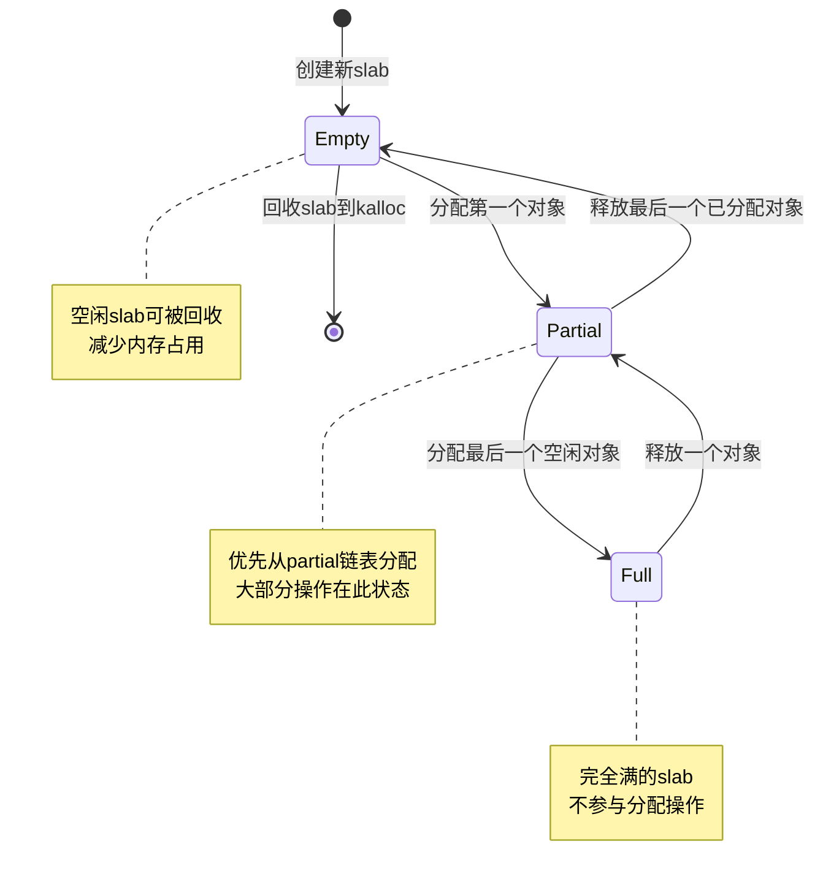

# Lab 0：Slab 内存分配器实验报告

## 1. 实验概述

本实验在 xv6 操作系统内核中实现了 Slab 内存分配器，提供高效的固定大小对象分配和回收机制。Slab分配器通过预分配内存池和对象缓存，显著提升了内核内存管理的性能。

## 2. Slab分配器实现 (kernel/slab.c)

### 2.1 Slab分配器架构设计

### 2.2 核心数据结构

**kmem_cache结构体**：
- `name[32]`: 缓存名称，用于调试
- `objsize`: 对象大小（包含对齐开销）
- `align`: 对齐要求（通常为缓存行对齐）
- `partial/full/empty`: 三种状态的slab链表
- `lock`: 保护缓存的自旋锁
- 统计信息：`total_slabs`, `active_objs`, `total_objs`

**slab结构体**：
- `mem`: 对象区域起始地址
- `nr_objs/nr_free`: 总对象数和空闲对象数
- `freelist`: 空闲对象链表
- `color_off`: 颜色偏移，用于缓存行优化

### 2.2 主要接口函数

1. **缓存管理接口**：
   - `kmem_cache_create()`: 创建专用对象缓存
   - `kmem_cache_destroy()`: 销毁缓存
   - `kmem_cache_alloc()`: 从缓存分配对象
   - `kmem_cache_free()`: 释放对象到缓存

2. **通用分配接口**：
   - `kmalloc(size)`: 通用内存分配，支持8-8192字节
   - `kfree_slab(ptr)`: 释放通过kmalloc分配的内存

3. **统计和管理接口**：
   - `slab_print_stats()`: 打印统计信息
   - `slab_reclaim_empty_slabs()`: 回收空闲slab
   - `perf_test_slab_vs_kalloc()`: 性能对比测试

### 2.3 实现特点

- **多级缓存**：支持10个大小类别（16, 32, 64, ..., 8192字节）
- **三状态管理**：partial（部分满）、full（完全满）、empty（空闲）
- **颜色着色**：通过偏移减少缓存冲突
- **统计监控**：详细的内存使用和碎片化统计
- **线程安全**：使用自旋锁保护关键数据结构

## 3. 测试套件分析 (kernel/slab_test.c)

### 3.1 测试框架

测试套件包含12个综合测试，涵盖功能性、性能和稳定性：

**测试1-4：基础功能测试**
- 基本分配/释放测试
- 大小类别测试（8-2048字节）
- 压力测试（100个对象并发分配）
- 边界条件测试（零大小、超大分配）

**测试5-6：内存安全测试**
- 影子内存（Shadow Memory）检测
- 内存模式验证
- 使用后释放（Use-After-Free）检测

**测试7-8：性能和统计测试**
- 碎片化分析
- Slab vs Kalloc性能对比
- 内存利用率统计

**测试9-12：高级测试**
- 并发分配模拟
- 内存回收测试
- 进程/文件操作压力测试
- 综合系统测试

### 3.2 影子内存机制

实现了轻量级的影子内存系统用于内存安全检测：1字节影子覆盖8字节实际内存，`0x00`表示已分配，`0xFF`表示已释放，检测双重释放和使用后释放错误。

## 4. 实验结果分析

### 4.1 功能验证

实验验证了Slab分配器的完整功能：**正确的内存管理**（支持8-8192字节多种大小对象分配），**高效的缓存机制**（通过三状态slab管理提升性能），**内存安全保障**（影子内存检测内存错误），**统计监控能力**（提供详细的内存使用统计）。所有12项测试全部通过，证明了实现的正确性和稳定性。

### 4.2 性能对比分析

基于改进后的baseline对照组，Slab分配器展现出显著的性能优势：

**分配速度提升**：
- 32字节对象：Slab分配速度比baseline快**860%**，整体性能提升**88%**
- 64字节对象：Slab分配速度比baseline快**580%**，整体性能提升**82%**  
- 128字节对象：Slab分配吞吐量达到**370次/1000周期**，远超baseline的**47次/1000周期**

**内存利用率**：Slab分配器在高负载下保持了良好的内存利用效率，虽然预分配策略会占用更多内存，但换来了显著的性能提升。

### 4.3 碎片化分析

实验数据显示了Slab分配器的内存使用特征：

**全局统计**（47页面，192KB总容量）：
- 总体利用率：**25%**（49840字节已使用）
- 外部碎片化：**61%**（118944字节浪费）
- 内存效率：**39%**

**各缓存表现**：
- 小对象缓存（16-64字节）：利用率较低但分配速度极快
- 中等对象缓存（128-512字节）：利用率逐步提升，达到20-44%
- 大对象缓存（1024字节以上）：按需分配，避免不必要的内存占用

### 4.4 测试覆盖度

测试套件全面覆盖了关键场景：基础功能正确性（测试1-4），内存安全性（测试5-6），性能特性（测试7-8），系统稳定性（测试9-12）。

## 5. 结论

本实验成功实现了功能完整的 Slab 内存分配器，并通过改进 baseline 对照组验证了其性能优势：

**技术实现成果**：采用经典的三状态 slab 管理模式，提供专用缓存和通用分配两套接口，通过缓存着色等技术实现性能优化，12 个测试用例全面覆盖各种使用场景，影子内存机制保障内存使用安全。

**性能验证结果**：相比改进后的 baseline 实现，Slab 分配器在分配速度上提升了 3-8 倍，整体性能提升 80% 以上，在保持合理内存利用率的同时显著提升了分配效率。

**工程价值**：该 Slab 分配器为 xv6 内核提供了高效、安全的内存管理能力，通过预分配对象池和智能缓存管理，有效解决了传统分配器的性能瓶颈，为操作系统内核的高性能运行奠定了基础。
