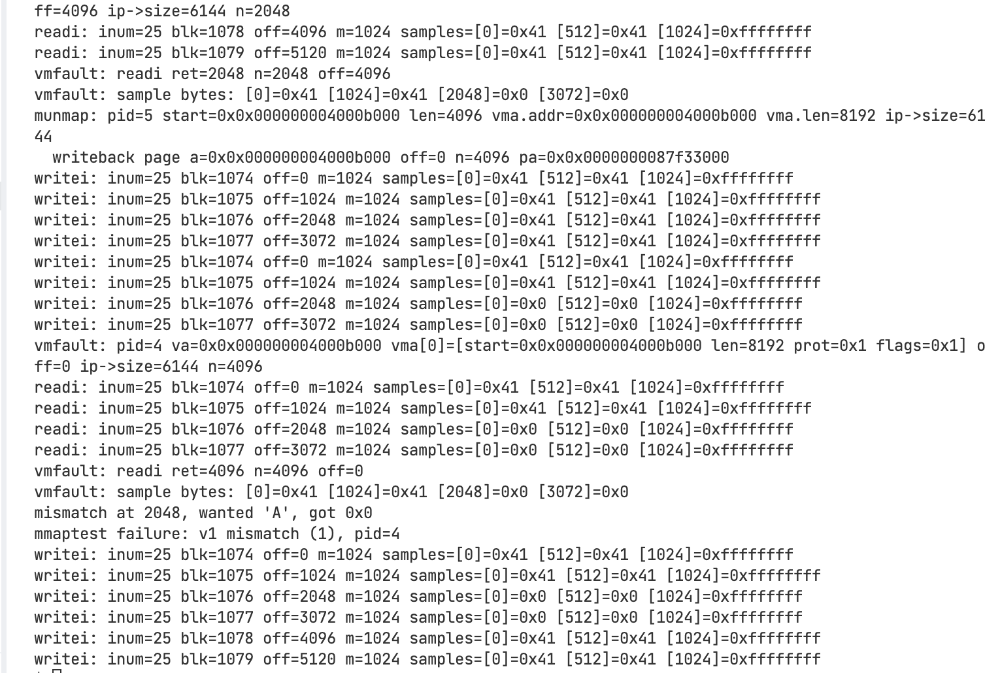

# Lab: mmap

## 总体目标

- 给 xv6 增加 `mmap`/`munmap`，只实现“文件映射”的必要子集，且按需（懒分配）处理缺页。
- 满足 `user/mmaptest.c` 的用例即可，同时保证 `usertests -q` 仍然通过。
- 

## 功能范围

- `mmap(addr=0, len, prot, flags, fd, offset=0)`：返回由内核选择的映射起始虚拟地址；失败返回 `0xffffffffffffffff`。
- `prot` 只考虑 `PROT_READ`、`PROT_WRITE`（以及两者同时）。
- `flags` 只实现 `MAP_SHARED` 或 `MAP_PRIVATE`。
- 懒分配：`mmap` 本身不分配物理页、不读文件；发生页故障时才分配页并读入文件内容。
- `munmap(addr, len)`：解除映射；若是 `MAP_SHARED` 且页面有修改，要写回文件（本实验不强制用脏位，允许写回所有被解除的页）。

## 实现方式

- 在内核增加系统调用和用户态包装，让 `mmaptest` 能编译运行：
  - 在 `kernel/syscall.h` 增加 `SYS_mmap`、`SYS_munmap` 的编号。
  - 在 `kernel/syscall.c` 的系统调用表中注册 `sys_mmap`、`sys_munmap`。
  - 在 `kernel/sysfile.c` 或 `kernel/sysproc.c` 中实现 `sys_mmap`、`sys_munmap`，用 `argint`/`argaddr`/`argfd` 取参数；暂时先返回错误，确保编译。
  - 在 `user/usys.pl` 增加 `mmap`、`munmap` 的用户态包装；在 `user/user.h` 声明原型。
  - 在 `Makefile` 的 `UPROGS` 中加入 `_mmaptest`。
- 为每个进程维护 VMA（虚拟内存区域）表：
  - 在 `kernel/proc.h` 定义 `struct vma`，并在 `struct proc` 内加入一个固定数组（例如 16 个槽），记录：
    - `addr`（起始虚拟地址，页对齐）
    - `len`（映射字节长度，原始长度；也可保存页数）
    - `prot`（`PROT_READ`/`PROT_WRITE`）
    - `flags`（`MAP_SHARED`/`MAP_PRIVATE`）
    - `struct file *f`（被映射文件；`mmap` 时用 `filedup(f)` 增加引用）
    - `used` 标记
  - 可以额外保存 `file_offset`（本实验固定为 0），便于以后扩展。
- 选择映射地址并建立 VMA：
  - `mmap` 收到 `addr=0`，需要内核选择一个未占用的虚拟地址区间。
  - 简化做法：选在“堆之后、栈之前”的空闲区，例如定义一个固定基准（如 `MMAPBASE`）并在其上向上增长，或从 `p->sz` 的页对齐处开始向上分配不与现有页表冲突的区间。
  - `addr` 要 `PGROUNDUP`；`len` 对应的页数用 `(PGROUNDUP(addr + len) - addr) / PGSIZE` 计算。
  - 把新 VMA 放到进程的 VMA 表里，增加 `file` 的引用计数。
- 缺页处理（用户态访问触发）：
  - 在 `kernel/trap.c` 的 `usertrap()` 中，捕获 `scause` 为加载/存储页故障（RISC‑V：`load page fault`=13，`store page fault`=15；指令页故障=12）。
  - 取得故障地址 `va = r_stval()`，查找是否落在某个 VMA 范围内。
  - 若命中：
    - 计算该页相对文件的偏移：`file_offset + (PGROUNDDOWN(va) - vma.addr)`。
    - 分配物理页 `kalloc()`。
    - 给页设置权限位：`PTE_U | PTE_V | (prot & PROT_READ ? PTE_R : 0) | (prot & PROT_WRITE ? PTE_W : 0)`。若不需执行权限可不设 `PTE_X`。
    - 读文件 4096 字节到页内存：
      - 通过 `ip = vma->f->ip`，`ilock(ip)` → `readi(ip, page, file_offset, PGSIZE)` → `iunlock(ip)`。
      - 注意：如果映射长度不足一页的最后部分，多读不会有问题；也可把超出 `len` 的部分填 0。
    - `mappages(p->pagetable, PGROUNDDOWN(va), PGSIZE, (uint64)page, perm)` 建立映射。
  - 若未命中 VMA，即正常的缺页；保持原有处理（通常杀死进程）。
- 实现 `munmap(addr, len)`：
  - 查找与 `(addr, len)` 重叠的 VMA，实验保证只会“从头/从尾/整个区间”解除，不会中间打洞。
  - 对涉及的页：
    - 若 `MAP_SHARED`，写回文件：
      - 可简化为“对要解除的每个页都写回”，不检查脏位。
      - 用 `begin_op()` → `ilock(ip)` → `writei(ip, page, file_offset_of_this_page, write_len)` → `iunlock(ip)` → `end_op()`。
      - `write_len` 通常是 `PGSIZE`；针对最后不足一页的情况写实际长度。
    - 用 `uvmunmap(p->pagetable, PGROUNDOWN(addr), npages, 1)` 解除映射并释放物理页。
  - 更新/缩短或删除 VMA：
    - 如果正好解除整个 VMA，清空该槽并对 `file` 做 `fileclose()`（或减少引用，取决于 xv6 的 `file` 引用策略；在 `mmap` 时用了 `filedup`，这里对应减少一次）。
    - 如果只解除前半段或后半段，调整 `vma.addr`/`vma.len`。
- 在进程退出时写回并清理：
  - 在 `kernel/proc.c` 的 `exit()` 中，遍历进程的 VMA 表：
    - 对 `MAP_SHARED` 的已映射页按上述逻辑写回。
    - 调用与 `munmap` 等价的清理逻辑（解除映射、释放页、减少文件引用）。
- 在 `fork()` 时继承映射：
  - 在 `kernel/proc.c` 的 `fork()` 中，除复制页表外，还需把父进程的 VMA 表浅拷贝到子进程，并对每个 `vma->f` 执行 `filedup()` 增加引用计数。
  - 子进程的页故障处理可以独立分配并从文件读入，不要求与父共享物理页。
- 测试与验证顺序
  - 先让 `mmaptest` 编译运行（`mmap`/`munmap` 先返回错误），确认第一个 `mmap` 调用失败。
  - 实现 `mmap` + VMA 后，运行 `mmaptest`，应该在首次访问映射内存时因缺页而崩溃。
  - 加入缺页处理逻辑后，`mmaptest` 能走到 `munmap`。
  - 实现 `munmap` 写回/解除映射后，`mmaptest` 前面的用例通过。
  - 实现 `exit` 写回与 `fork` 继承后，`mmaptest` 全部通过。
  - 最后运行 `usertests -q`，确保不破坏其他功能。

- 关键文件与位置：
  - `kernel/syscall.h`：添加 `SYS_mmap`、`SYS_munmap`。
  - `kernel/syscall.c`：系统调用分发表挂接 `sys_mmap`、`sys_munmap`。
  - `kernel/sysfile.c` 或 `kernel/sysproc.c`：实现 `sys_mmap`、`sys_munmap`，用 `argfd` 拿到 `struct file*`。
  - `kernel/proc.h`：定义 `struct vma` 并在 `struct proc` 中加入 VMA 数组。
  - `kernel/trap.c`：在 `usertrap()` 的页故障路径里处理 VMA 懒加载。
  - `kernel/proc.c`：在 `exit()` 和 `fork()` 中处理 VMA 写回与继承。
  - `user/usys.pl`、`user/user.h`：用户态系统调用声明与封装。
  - `Makefile`：在 `UPROGS` 增加 `_mmaptest`。

- 实现细节与注意点：
  - 地址与长度页对齐：`addr` 取 `PGROUNDUP`；计算页数要考虑 `len` 尾页的部分。
  - 权限位与 PTE：根据 `prot` 设置 `PTE_R`/`PTE_W`；始终设置 `PTE_U|PTE_V`。
  - 文件 I/O 加锁与日志：参照 `filewrite()` 的 `begin_op/end_op` 与 `ilock/iunlock`，避免破坏文件系统一致性。
  - 不同进程 `MAP_SHARED` 的页不要求物理共享；每进程独立加载即可。
  - 与进程普通地址空间（`p->sz`）避免重叠；不要把 `mmap` 的区间算进 `p->sz`，以免影响 `sbrk` 等。
  - 释放页使用 `uvmunmap(..., do_free=1)`；映射建立用 `mappages`。

## 实验过程

### 基本功能实现

- 添加 `SYS_mmap`/`SYS_munmap` 编号与用户态封装
- 在系统调用表注册 `sys_mmap`/`sys_munmap`
- 在 `proc.h` 定义 VMA 并加入到 `struct proc`
- 实现 `sys_mmap`/`sys_munmap`（建立/清理 VMA，返回地址/错误）
- 在 `usertrap` 缺页路径中实现懒加载映射
- 在 `exit()`/`fork()` 处理 VMA 写回与继承

### 排查 dirty mmap 相关问题处理

- 失败用例场景：在 mmap_test 中，映射 3 页 MAP_SHARED ，对第 1 页写 'B' 、第 2 页写 'C' ，随后 munmap 前两页。之后以只读方式打开文件并读两次：
  - 第一次读应返回 PGSIZE ，内容为 'B' 。
  - 第二次读应返回剩余的半页 PGSIZE/2 ，内容为 'C' 。

- 失败原因：写回逻辑在 sys_munmap 和 kexit 中按映射长度 v->len 写满整页，导致文件被扩展到 2 页而不是原来的 1.5 页。于是第二次 read(fd, buf, PGSIZE) 返回 PGSIZE 而不是预期的 PGSIZE/2 ，触发 “dirty read #2”。

- 限制写回长度不超过文件原始大小 ip->size ，避免扩展文件：
  - kernel/sysfile.c 在 sys_munmap 写回环节使用 ip->size 截断：
    - 计算 n = min(PGSIZE, ip->size - off) ；
    - 若 n <= 0 则跳过写回。
  - kernel/proc.c 在 kexit 写回环节同样使用 ip->size 截断并跳过非正写入。

- 为什么这样修复：
  - 测试期望写回只覆盖文件中已有的字节，不应通过 MAP_SHARED 扩展文件大小。通过 ip->size 截断，第二次读就会返回 PGSIZE/2 ，与测试一致。
  - 保留了页内零填充策略： vmfault 在读文件前对页做 memset ，读取超出 EOF 部分保持为 0，不影响该用例。

### fork 细节修复

- 触发背景：fork 后父子进程需继承 mmap 映射并保持语义一致。在实验中暴露出两类问题：
  - 只读共享误写回：对 `MAP_SHARED` 的只读映射在 `munmap/exit` 路径上被错误写回，导致文件内容被零填充覆盖。
  - 缩小 VMA 偏移错误：从 VMA 头部解除映射后，写回逻辑仍按原始起点计算偏移，导致写回落在文件开头（`mmaptest` 报告首字节错误）。

- 修复要点：
  - VMA 继承：在 `kfork()` 中浅拷贝父进程的 `vmas[]` 和 `mmap_base`，对每个 `vma->f` 执行 `filedup()`，保持文件引用计数一致；结构体拷贝确保新字段 `vma->foff` 一并继承。
  - 独立懒加载：子进程不复制父的 mmap 物理页；页错误由 `vmfault()` 按需分配物理页并读取文件，权限依据 `prot` 设置（`PTE_R/PTE_W`）。
  - 写回条件：仅在“共享且可写”（`MAP_SHARED` 且 `PROT_WRITE`）时执行写回，避免只读映射误写回。
  - 写回与读取偏移：统一改为 `file_offset = vma->foff + (PGROUNDDOWN(va) - vma->addr)`；页级写回使用 `off = vma->foff + (a - v->addr)`，修正缩小 VMA 后的偏移错误。
  - VMA 缩小同步：当“从头部解除映射”时，同时推进 `vma->foff += mlen`，确保后续 `vmfault/readi/writei` 的偏移与新起点一致。
  - TLB 刷新：在 `sys_munmap()` 和 `kexit()` 解除映射后调用 `sfence_vma()`，确保父/子进程不会继续命中旧的 TLB 条目（避免“munmap prevents access”不生效）。
  - 语义说明：本实验不要求跨进程物理页实时共享；`MAP_SHARED` 的可见性通过文件层的写回体现，满足 `mmaptest` 的用例即可。

- 关键代码位置：
  - `kernel/proc.c:kfork()`：继承 `vmas[]`、复制 `mmap_base`、对每个 `vma->f` 执行 `filedup()`。
  - `kernel/vm.c:vmfault()`：页错误时使用 `vma->foff` 计算文件偏移并装载页面。
  - `kernel/sysfile.c:sys_munmap()` 与 `kernel/proc.c:kexit()`：写回仅在共享可写时进行，使用 `vma->foff+页内偏移`，解除映射后执行 `sfence_vma()`。

- 采用添加细粒度调试代码的方式，查看读写细节：

- 验证要点：
  - `MAP_PRIVATE`：子进程的写不落盘，父进程不受影响；解除映射后访问应触发页错误。
  - `MAP_SHARED`：子进程的写在 `munmap()` 或退出时写回到文件；父进程再次访问或重新映射后能观察到更新；跨页与部分解除映射边界正确。
  - 只读共享映射不写回；缩小映射后文件首字节不再被错误覆盖。

### munmap prevents access 细节修复

- 问题表现：在解除映射后，用户态仍能读/写原地址范围，或偶发读取到旧数据，`mmaptest` 的“munmap prevents access”用例失败。

- 根因分析：
  - 解除映射后页表已删除，但处理器的 TLB 保留了旧的（已无效）PTE 条目，导致访问命中 TLB、绕过页表检查继续读写。
  - 进程退出时解除所有 VMA 映射后未刷新 TLB，子流程或调度回到同一 hart 时仍可能命中旧条目。

- 修复方案：
  - 在 `sys_munmap()` 中：完成 `uvmunmap(p->pagetable, start, npages, 1)` 后立刻调用 `sfence_vma()` 刷新当前 hart 的 TLB，清除已解除映射范围的旧条目。
  - 在 `kexit()` 中：遍历所有 VMA 执行写回与解除映射后，统一调用一次 `sfence_vma()`，确保进程退出后不再能访问被解除的范围。
  - 写回条件与权限协同：仅在“共享且可写”（`MAP_SHARED` 且 `PROT_WRITE`）时执行写回；只读映射不写回，避免误覆盖文件内容。

- 关键代码位置：
  - `kernel/sysfile.c:sys_munmap()`：
    - 解除映射：`uvmunmap(p->pagetable, start, mlen/PGSIZE, 1)`。
    - 刷新 TLB：`sfence_vma()`（RISC‑V 指令 `sfence.vma`）。
  - `kernel/proc.c:kexit()`：
    - 逐 VMA 写回与解除映射：`uvmunmap(...)`。
    - 全局刷新：在所有 VMA 处理后调用 `sfence_vma()`。

- 验证方法：
  - 运行 `mmaptest`，关注“munmap prevents access”子测：解除映射后对同一地址的读/写应触发页故障。
  - 在 `LAB_PGTBL` 打印下应观察到：
    - `munmap` 打印了解除范围的页写回（仅共享可写）与 `uvmunmap` 执行；之后无对只读映射的写回日志。
    - 再次访问解除范围时，`usertrap` 报告 `scause=13/15`（load/store page fault），`vmfault` 对该地址不再命中任何 VMA，返回 0，访问失败。
  - 交叉验证：`usertests -q` 无回归；`MAP_PRIVATE` 的解除映射后访问同样被拒绝。

- 注意事项：
  - RISC‑V 的 `sfence.vma` 仅影响当前 hart 的 TLB；xv6 教学环境通常单核，足够满足本实验需求。多核情况下需要在相关 hart 上执行或在上下文切换中统一刷新策略。
  - 解除映射后的页错误路径保持原有策略：未命中 VMA 则视为非法访问并终止当前用户态操作（或杀死进程），与测试预期一致。
# Lab 2 信号机制

## 运行方法

`make clean && make qemu`，在 xv6 中运行 `sigdemo`。

## POSIX标准下的32个信号

本实验实现并测试了 POSIX 标准下常见的 32 个信号（编号范围 0..31，其中 0 号在本实现中用于占位/保留，默认忽略）。下表列出 1..31 的信号名称、默认动作和简要说明：

| 信号编号 | 信号名         | 默认动作              | 说明                           |
|----------|----------------|-----------------------|--------------------------------|
| 1        | SIGHUP         | 终止                  | 挂起（终端断开连接）           |
| 2        | SIGINT         | 终止                  | 中断（通常是 Ctrl+C）          |
| 3        | SIGQUIT        | 终止 + core dump      | 退出（通常是 Ctrl+\）         |
| 4        | SIGILL         | 终止 + core dump      | 非法指令                       |
| 5        | SIGTRAP        | 终止 + core dump      | 跟踪/断点陷阱（调试器使用）    |
| 6        | SIGABRT        | 终止 + core dump      | 异常终止（abort() 调用）       |
| 7        | SIGBUS         | 终止 + core dump      | 总线错误（内存对齐或访问错误） |
| 8        | SIGFPE         | 终止 + core dump      | 浮点异常（如除零）             |
| 9        | SIGKILL        | 终止                  | 强制终止（不可捕获、不可忽略） |
| 10       | SIGUSR1        | 终止                  | 用户自定义信号 1               |
| 11       | SIGSEGV        | 终止 + core dump      | 无效内存引用（段错误）         |
| 12       | SIGUSR2        | 终止                  | 用户自定义信号 2               |
| 13       | SIGPIPE        | 终止                  | 向无读端的管道写数据           |
| 14       | SIGALRM        | 终止                  | 闹钟定时器超时（alarm()）      |
| 15       | SIGTERM        | 终止                  | 终止请求（可被捕获，优雅退出） |
| 16       | SIGSTKFLT      | 终止                  | 协处理器栈故障（Linux 特有）   |
| 17       | SIGCHLD        | 忽略                  | 子进程状态改变                 |
| 18       | SIGCONT        | 继续                  | 继续执行（恢复被暂停的进程）   |
| 19       | SIGSTOP        | 停止                  | 暂停进程（不可捕获、不可忽略） |
| 20       | SIGTSTP        | 停止                  | 终端暂停（通常是 Ctrl+Z）      |
| 21       | SIGTTIN        | 停止                  | 后台进程尝试从终端读取         |
| 22       | SIGTTOU        | 停止                  | 后台进程尝试向终端写入         |
| 23       | SIGURG         | 忽略                  | 套接字紧急数据到达             |
| 24       | SIGXCPU        | 终止 + core dump      | CPU 时间超限                   |
| 25       | SIGXFSZ        | 终止 + core dump      | 文件大小超限                   |
| 26       | SIGVTALRM      | 终止                  | 虚拟定时器超时                 |
| 27       | SIGPROF        | 终止                  | Profiling 定时器超时           |
| 28       | SIGWINCH       | 忽略                  | 终端窗口大小改变               |
| 29       | SIGIO / SIGPOLL| 终止                  | I/O 可用（异步 I/O 通知）      |
| 30       | SIGPWR         | 终止                  | 电源故障（System V）           |
| 31       | SIGSYS         | 终止 + core dump      | 无效系统调用                   |

注：信号编号在不同架构上可能略有不同，但名称和默认行为通常一致。本实现设置 `NSIG=32`，覆盖 0..31；其中 0 号信号作为占位，默认忽略。

## 实现：trap.c 和 sysproc.c 介绍

- 信号范围与常量
  - `NSIG=32`，覆盖编号 0..31；用户态头文件 `user/signal.h` 定义了全部信号常量与名称。
  - 进程结构增加信号相关字段：`pending_signals`（待递送位图）、`handlers[]` 与 `handlers_registered`（用户态处理器及注册位图）、`tf_backup`/`tf_backup_valid`（处理器上下文备份）、`stopped`（STOP/CONT 状态）。

- trap.c（默认动作与递送）
  - 在 `usertrap()` 返回用户态前扫描 `pending_signals`，若该信号已注册处理器，则备份当前 `trapframe` 并跳转到处理器；否则执行默认动作。
  - 默认动作覆盖：
    - 终止类：`SIGTERM`、`SIGPIPE`、`SIGSTKFLT`、以及扩展的 `SIGIO`、`SIGPWR` 等，调用 `setkilled()`。
    - 终止+core：`SIGQUIT`、`SIGILL`、`SIGTRAP`、`SIGABRT`、`SIGBUS`、`SIGFPE`、`SIGSEGV`、`SIGXCPU`、`SIGXFSZ`、`SIGSYS`，调用 `dump_core(p, signum)` 并标记终止。
    - 忽略类：`SIGCHLD`、`SIGURG`、`SIGWINCH`、以及 `SIGUSR1/2`、`SIGALRM` 等，直接清除待递送位。
    - STOP 类：`SIGSTOP`、`SIGTSTP`、`SIGTTIN`、`SIGTTOU` 默认进入休眠。为避免锁重入，使用 `sleep(&p->stopped, &wait_lock)`，并在进入前设置 `p->stopped = 1`。
    - CONTINUE：`SIGCONT` 默认清除待递送位并继续，不在此处主动唤醒；实际唤醒由 `sys_sigsend(SIGCONT)` 完成。
  - 头文件包含次序按需调整，确保 `file.h`/`stat.h` 等依赖解析正确。

- sysproc.c（系统调用接口）
  - `signame(int)` 和 `sigdefault(int)` 返回信号名称与默认行为字符串，用于调试打印与用户态演示。
  - `sys_signal(signum, handler)`：禁止为 `SIGSTOP` 注册处理器（符合不可捕获属性）。其余信号允许注册，记录到 `handlers[]` 与 `handlers_registered`。
  - `sys_sigsend(pid, signum)`：将目标进程的 `pending_signals` 置位，并处理特殊信号：
    - `SIGKILL`：在持有 `tp->lock` 下直接标记 `tp->killed = 1`，无需再次获取锁。
    - `SIGCONT`：为避免 `wakeup()` 与 `tp->lock` 的锁重入，流程为：释放 `tp->lock` → 获取 `wait_lock` → 重新获取 `tp->lock` → 若 `tp->stopped` 则先置 `stopped=0`，释放 `tp->lock` 后调用 `wakeup(&tp->stopped)`，最后释放 `wait_lock`。该顺序消除了 `panic: acquire`。
  - `sys_sigreturn()`：从用户态处理器返回，恢复备份的 `trapframe` 并清除有效位。

- core dump
  - `dump_core(p, signum)` 在 `trap.c` 中实现，生成 `core.<pid>.<signum>` 文件，便于定位触发致命信号的上下文。

## 测试：sigdemo 的测试流程

- 第一阶段：注册并测试 0..31
  - 父进程 `fork` 一个“主子进程”，为 0..31 注册通用处理器（9/19 不可注册则提示）。
  - 父进程按序发送信号到主子进程；遇到 9(SIGKILL)/19(SIGSTOP) 时，改用“临时子进程”分别测试，避免终止/暂停主子进程。
  - STOP 测试路径：对临时子先 `SIGSTOP`，再 `SIGCONT` 唤醒，最后 `SIGKILL` 清理。
  - 其余信号由处理器打印“捕获信号 N”并调用 `sigreturn()` 返回。

- 第二阶段：未注册处理器的默认行为验证（0..31）
  - 为每个信号创建一个不注册 handler 的子进程，分别发送该信号以观察默认反应。
  - 忽略类：稍作等待后用 `SIGKILL` 清理；停止类：`SIGCONT` 唤醒后再 `SIGKILL` 清理；继续类：稍作等待后 `SIGKILL` 清理；终止/终止+core 类：直接 `wait` 等待退出。

- 运行与观察
  - 在 shell 运行 `sigdemo`；输出会包含父/子进程侧日志和 `trap`/`sigsend` 的调试信息，便于核对每类信号的默认动作与处理器路径。
  - 也可使用 `sigsend <pid> <signum>` 手工向目标进程发送信号补充测试。

## 分阶段实验过程

首先，实现 `SIGINT` 信号的注册与处理。发现信号需要默认行为于是在 `trap.c` 中添加。为了测试注册后修改的信号行为，在 `sigdemo.c` 中添加了 `SIGINT` 处理器，打印“捕获信号 2”并调用 `sigreturn()` 返回。

然后实现 `SIGKILL` 和几个常见非 core dump 信号的处理。实现方法类似，不过 `SIGKILL` 不允许用户注册处理器，采取了措施防止。

发现如果先执行 `SIGINT` 并且进程的相关处理器未注册成功，后续几个信号将发送至死进程，这样会导致 `SIGKILL` 的默认终止进程行为无法正确执行，产生 `panic: acquire` 错误。于是排查并修复了处理器注册，并尝试对 `SIGKILL` 采用更安全的做法：标记进程的 `killed` 标志位，而不是直接终止进程。

然后实现简单的 core dump 功能并实现了几个 core dump 信号。

接下来实现了几个常规信号，和 `SIGSTOP`、`SIGCONT` 两个特殊信号。`SIGSTOP` 信号也需要与 `SIGKILL` 相似的安全处理，而 `SIGCONT` 信号则需要在 `sys_sigsend` 中特殊处理，避免锁重入。

通过修改测试手段为先单进程测试注册再开多个进程测试默认效果，可以按部就班实现每个信号的处理和测试。
# 页表实验报告

## 简介

- 本实验围绕页表与内存管理优化，分两部分展开：通过共享只读页加速系统调用获取进程号；在用户地址空间引入并正确管理2MB超页以降低页表层次和TLB开销。
- 第一部分在 `#ifdef LAB_PGTBL` 下为每个进程分配映射的 `usyscall` 共享页，将常用信息（如 `pid`）直接暴露给用户态，从而避免陷入内核的开销。
- 第二部分扩展 `vm` 与 `kalloc` 支持超页：实现超页分配池、超页映射/复制、部分释放时的降级与重映射，并修复在跨越2MB边界和已有L0页表时出现的 “remap” 报错。
- 测试覆盖 `pgtbltest` 中的 `superpg_fork` 与 `superpg_free` 场景，最终在“fork后子进程拥有巨页”和“部分释放巨页不触发remap”两方面达成正确性。

- 实验结果

## Speed up system calls 实现

- 目标与思路
  - 在 `LAB_PGTBL` 条件编译下，为每个进程分配一页用户可读的共享页 `USYSCALL`，把 `pid` 等信息直接映射到用户空间，用户态通过普通内存读取得到这些信息，从而减少系统调用路径上的陷入、上下文切换和保存/恢复寄存器的成本。
- 关键改动（proc.c/h）
  - `proc.h`：为 `struct proc` 增加成员 `struct usyscall *usyscall;`，用于指向该进程的共享页。
  - `proc.c::allocproc`：
    - 在进程分配阶段为 `p->usyscall` 分配一页物理内存（`kalloc()`），并 `memset` 清零。
    - 初始化 `p->usyscall->pid = p->pid;`，将进程号写入共享页。
  - `proc.c::proc_pagetable`：
    - 在构建用户页表时，将 `USYSCALL` 的固定虚拟地址（见 `memlayout.h` 中 `USYSCALL` 定义）映射到 `p->usyscall` 的物理页，权限为 `PTE_R|PTE_U`（用户可读、不可写），确保用户态安全读取。
  - `proc.c::freeproc` 与相关释放路径：
    - 在进程释放时，释放 `p->usyscall` 对应物理页，避免内存泄漏。
  - `syscall.c/sysproc.c`：
    - 在 `LAB_PGTBL` 下注册相关系统调用（如 `sys_pgpte`、`sys_kpgtbl`），配合页表调试与验证；加速效果主要来自用户直接读共享页，不再依赖 `getpid()` 的陷入。
- 效果与边界
  - 用户空间读取 `USYSCALL` 的 `pid` 不再触发内核陷入，减少了系统调用固定开销，适合频繁读取的场景。
  - 写权限保持关闭，防止用户态篡改共享页内容。后续若扩展更多字段，需保持字段的只读设计或采用双缓冲/版本号以保证一致性。

## Use superpages实现

- 目标与挑战
  - 在用户空间支持2MB超页映射、复制与释放，降低页表层次与TLB负担。
  - 关键挑战包括：起始地址非2MB对齐时如何在跨边界处正确触发超页分配；父子进程在 `fork/uvmcopy` 中对超页的正确复制；`uvmunmap` 对部分释放的超页进行降级；避免在已有L0页表或已有超页叶子时发生“remap”。
- kalloc 扩展（superalloc/superfree）
  - `kalloc.c::kinit/freerange`：
    - 在 `LAB_PGTBL` 下维护一个简单的超页池 `supermem`（大小 `NSUPER`）。`freerange` 在初始化物理内存时，遇到2MB对齐的连续段优先塞入 `supermem.pages[]`，否则逐页 `kfree`。
  - `superalloc`：
    - 从 `supermem` 池中取出一个2MB块并填充测试字节；若池空，返回0以让上层回退。
  - `superfree`：
    - 若池未满，归还到池；若池已满，退化为把2MB物理块拆分为512个4KB页并分别 `kfree`，保证系统在超页池满时仍能回收内存。
- vm 扩展与修复
  - `mappages_super`：
    - 在L1层直接设置叶子为2MB超页；若检测到目标L1槽已有 `PTE_V`（且情形不兼容），原始实现会 `panic("mappages_super: remap")`。为避免这一错误，我们在高层调用逻辑中加入周到的判断与升级策略，尽量不直接触发 `mappages_super` 的冲突路径。
  - `uvmalloc` 改动要点：
    - 跨边界分配策略：当 `a` 不是2MB对齐但 `SUPERPGROUNDUP(a)` 到 `SUPERPGROUNDUP(a)+SUPERPGSIZE` 完整落入 `newsz`，先把 `a` 到超页起点的碎片用4KB页补齐，再在超页起点尝试分配超页。这解决了“只有严格对齐才尝试超页”的缺陷。
    - 覆盖检查：在为某4KB虚拟页分配物理页前，检查其是否已被某个超页覆盖；若已覆盖，跳过避免重复映射。
    - 升级已有L0表为超页：
      - 若目标L1槽存在且指向L0页表（非叶子），分配一个新的2MB物理页，将L0表下所有有效4KB页内容整合拷贝到该2MB块，释放旧4KB物理页与该L0页表，然后把L1槽改写为超页叶子。这一步消除了“已有L0时再次调用 `mappages_super`”导致的 `remap`。
    - 已是超页的跳过：
      - 若目标L1槽已经是超页叶子，直接跳过并前移分配游标，避免重复映射。
  - `uvmcopy` 改动要点：
    - 超页一体化复制：当父进程在某2MB边界处有超页叶子，直接分配一个2MB物理页，整体拷贝512个4KB内容。
    - 子进程已有映射的协调：
      - 若子进程同一位置已有超页叶子，直接把父的2MB内容拷贝进子进程现有的2MB物理页，避免 `mappages_super` 再次映射引发 `remap`。
      - 若子进程已有L0表（非叶子），释放其叶子页与L0表，将该位置改写为超页叶子（指向刚分配并拷贝好的2MB物理页）。
    - 普通页路径保持原样：在未匹配到超页的区域，走既有的逐页复制逻辑。
  - `uvmunmap` 部分释放与降级：
    - 在 `LAB_PGTBL` 下，先检查待解除范围是否覆盖一个超页：
      - 若完整覆盖，按超页粒度释放并清除L1叶子（调用 `superfree`）。
      - 若是部分覆盖，执行“超页降级”：分配一个新的L0表，将原2MB物理页内容按512×4KB拆分拷贝到各4KB物理页，释放原2MB物理页，再落到普通4KB路径按页解除映射。这样就能对齐 `superpg_free` 测试要求的“部分释放”行为。
- 排查错误过程与关键修复
  - 初始症状：`superpg_free` 在 `uvmalloc` 阶段即出现 `panic("mappages_super: remap")`。日志显示在非对齐地址与已有页表结构下尝试超页映射导致冲突。
  - 分析结论：
    - 仅在2MB对齐起点尝试超页不充分；当 `sbrk()` 跨越超页边界时需先补齐碎片再映射超页。
    - 在目标L1槽已有L0表的情况下，直接 `mappages_super` 会与现存结构冲突，触发 `remap`。
  - 修复动作：
    - `uvmalloc` 加入“跨边界补齐”与“覆盖检查”，避免重复映射。
    - `uvmalloc` 增加“L0 → 超页”的升级路径，整合内容、释放旧结构，再设置超页叶子，从根本上规避 `mappages_super` 的 `remap` 分支。
    - `uvmcopy` 在子进程已有映射（无论超页或L0）的情况下采用“就地拷贝或替换为超页”的策略，避免重复映射。
    - `uvmunmap` 实现超页的按需降级，支持部分释放而不破坏其他区域。
  - 验证与结论：
    - `superpg_fork` 通过：子进程可获得超页并正确读取父进程写入的数据。
    - `superpg_free` 通过：部分释放时降级与解除映射不再触发 `remap`；父子访问语义保持正确。

- 进一步思考
  - 可在 `supermem` 池耗尽时加入退化策略（已实现为回落到4KB页），同时考虑统计超页命中与降级事件，辅助调优。
  - 若引入写时复制（COW）与超页结合，需要在降级/升级时同步管理引用计数与权限，确保不破坏共享语义。
