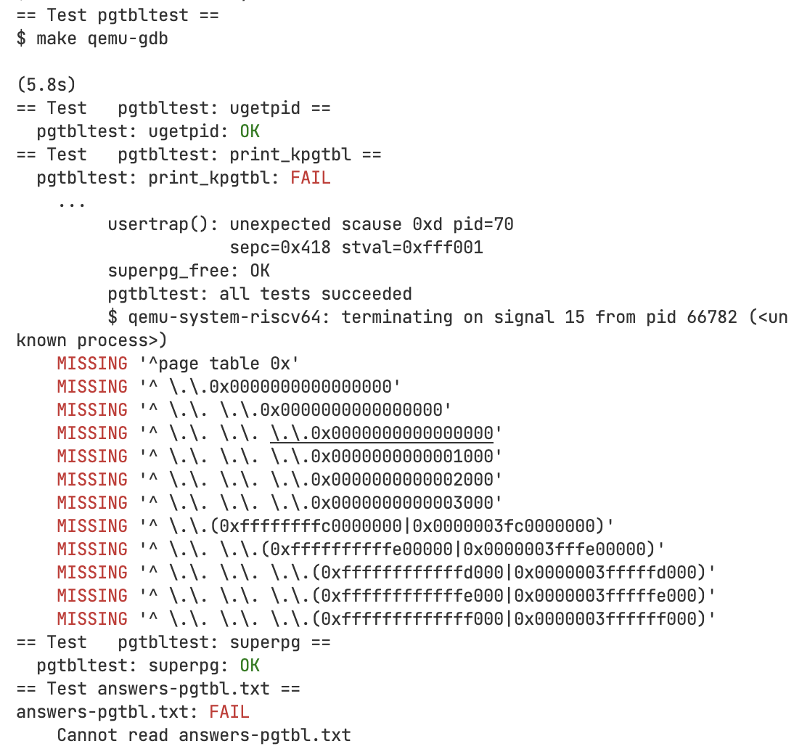

# Lab 2 信号机制

## 运行方法

`make clean && make qemu`，在 xv6 中运行 `sigdemo`。

## POSIX标准下的32个信号

本实验实现并测试了 POSIX 标准下常见的 32 个信号（编号范围 0..31，其中 0 号在本实现中用于占位/保留，默认忽略）。下表列出 1..31 的信号名称、默认动作和简要说明：

| 信号编号 | 信号名         | 默认动作              | 说明                           |
|----------|----------------|-----------------------|--------------------------------|
| 1        | SIGHUP         | 终止                  | 挂起（终端断开连接）           |
| 2        | SIGINT         | 终止                  | 中断（通常是 Ctrl+C）          |
| 3        | SIGQUIT        | 终止 + core dump      | 退出（通常是 Ctrl+\）         |
| 4        | SIGILL         | 终止 + core dump      | 非法指令                       |
| 5        | SIGTRAP        | 终止 + core dump      | 跟踪/断点陷阱（调试器使用）    |
| 6        | SIGABRT        | 终止 + core dump      | 异常终止（abort() 调用）       |
| 7        | SIGBUS         | 终止 + core dump      | 总线错误（内存对齐或访问错误） |
| 8        | SIGFPE         | 终止 + core dump      | 浮点异常（如除零）             |
| 9        | SIGKILL        | 终止                  | 强制终止（不可捕获、不可忽略） |
| 10       | SIGUSR1        | 终止                  | 用户自定义信号 1               |
| 11       | SIGSEGV        | 终止 + core dump      | 无效内存引用（段错误）         |
| 12       | SIGUSR2        | 终止                  | 用户自定义信号 2               |
| 13       | SIGPIPE        | 终止                  | 向无读端的管道写数据           |
| 14       | SIGALRM        | 终止                  | 闹钟定时器超时（alarm()）      |
| 15       | SIGTERM        | 终止                  | 终止请求（可被捕获，优雅退出） |
| 16       | SIGSTKFLT      | 终止                  | 协处理器栈故障（Linux 特有）   |
| 17       | SIGCHLD        | 忽略                  | 子进程状态改变                 |
| 18       | SIGCONT        | 继续                  | 继续执行（恢复被暂停的进程）   |
| 19       | SIGSTOP        | 停止                  | 暂停进程（不可捕获、不可忽略） |
| 20       | SIGTSTP        | 停止                  | 终端暂停（通常是 Ctrl+Z）      |
| 21       | SIGTTIN        | 停止                  | 后台进程尝试从终端读取         |
| 22       | SIGTTOU        | 停止                  | 后台进程尝试向终端写入         |
| 23       | SIGURG         | 忽略                  | 套接字紧急数据到达             |
| 24       | SIGXCPU        | 终止 + core dump      | CPU 时间超限                   |
| 25       | SIGXFSZ        | 终止 + core dump      | 文件大小超限                   |
| 26       | SIGVTALRM      | 终止                  | 虚拟定时器超时                 |
| 27       | SIGPROF        | 终止                  | Profiling 定时器超时           |
| 28       | SIGWINCH       | 忽略                  | 终端窗口大小改变               |
| 29       | SIGIO / SIGPOLL| 终止                  | I/O 可用（异步 I/O 通知）      |
| 30       | SIGPWR         | 终止                  | 电源故障（System V）           |
| 31       | SIGSYS         | 终止 + core dump      | 无效系统调用                   |

注：信号编号在不同架构上可能略有不同，但名称和默认行为通常一致。本实现设置 `NSIG=32`，覆盖 0..31；其中 0 号信号作为占位，默认忽略。

## 实现：trap.c 和 sysproc.c 介绍

- 信号范围与常量
  - `NSIG=32`，覆盖编号 0..31；用户态头文件 `user/signal.h` 定义了全部信号常量与名称。
  - 进程结构增加信号相关字段：`pending_signals`（待递送位图）、`handlers[]` 与 `handlers_registered`（用户态处理器及注册位图）、`tf_backup`/`tf_backup_valid`（处理器上下文备份）、`stopped`（STOP/CONT 状态）。

- trap.c（默认动作与递送）
  - 在 `usertrap()` 返回用户态前扫描 `pending_signals`，若该信号已注册处理器，则备份当前 `trapframe` 并跳转到处理器；否则执行默认动作。
  - 默认动作覆盖：
    - 终止类：`SIGTERM`、`SIGPIPE`、`SIGSTKFLT`、以及扩展的 `SIGIO`、`SIGPWR` 等，调用 `setkilled()`。
    - 终止+core：`SIGQUIT`、`SIGILL`、`SIGTRAP`、`SIGABRT`、`SIGBUS`、`SIGFPE`、`SIGSEGV`、`SIGXCPU`、`SIGXFSZ`、`SIGSYS`，调用 `dump_core(p, signum)` 并标记终止。
    - 忽略类：`SIGCHLD`、`SIGURG`、`SIGWINCH`、以及 `SIGUSR1/2`、`SIGALRM` 等，直接清除待递送位。
    - STOP 类：`SIGSTOP`、`SIGTSTP`、`SIGTTIN`、`SIGTTOU` 默认进入休眠。为避免锁重入，使用 `sleep(&p->stopped, &wait_lock)`，并在进入前设置 `p->stopped = 1`。
    - CONTINUE：`SIGCONT` 默认清除待递送位并继续，不在此处主动唤醒；实际唤醒由 `sys_sigsend(SIGCONT)` 完成。
  - 头文件包含次序按需调整，确保 `file.h`/`stat.h` 等依赖解析正确。

- sysproc.c（系统调用接口）
  - `signame(int)` 和 `sigdefault(int)` 返回信号名称与默认行为字符串，用于调试打印与用户态演示。
  - `sys_signal(signum, handler)`：禁止为 `SIGSTOP` 注册处理器（符合不可捕获属性）。其余信号允许注册，记录到 `handlers[]` 与 `handlers_registered`。
  - `sys_sigsend(pid, signum)`：将目标进程的 `pending_signals` 置位，并处理特殊信号：
    - `SIGKILL`：在持有 `tp->lock` 下直接标记 `tp->killed = 1`，无需再次获取锁。
    - `SIGCONT`：为避免 `wakeup()` 与 `tp->lock` 的锁重入，流程为：释放 `tp->lock` → 获取 `wait_lock` → 重新获取 `tp->lock` → 若 `tp->stopped` 则先置 `stopped=0`，释放 `tp->lock` 后调用 `wakeup(&tp->stopped)`，最后释放 `wait_lock`。该顺序消除了 `panic: acquire`。
  - `sys_sigreturn()`：从用户态处理器返回，恢复备份的 `trapframe` 并清除有效位。

- core dump
  - `dump_core(p, signum)` 在 `trap.c` 中实现，生成 `core.<pid>.<signum>` 文件，便于定位触发致命信号的上下文。

## 测试：sigdemo 的测试流程

- 第一阶段：注册并测试 0..31
  - 父进程 `fork` 一个“主子进程”，为 0..31 注册通用处理器（9/19 不可注册则提示）。
  - 父进程按序发送信号到主子进程；遇到 9(SIGKILL)/19(SIGSTOP) 时，改用“临时子进程”分别测试，避免终止/暂停主子进程。
  - STOP 测试路径：对临时子先 `SIGSTOP`，再 `SIGCONT` 唤醒，最后 `SIGKILL` 清理。
  - 其余信号由处理器打印“捕获信号 N”并调用 `sigreturn()` 返回。

- 第二阶段：未注册处理器的默认行为验证（0..31）
  - 为每个信号创建一个不注册 handler 的子进程，分别发送该信号以观察默认反应。
  - 忽略类：稍作等待后用 `SIGKILL` 清理；停止类：`SIGCONT` 唤醒后再 `SIGKILL` 清理；继续类：稍作等待后 `SIGKILL` 清理；终止/终止+core 类：直接 `wait` 等待退出。

- 运行与观察
  - 在 shell 运行 `sigdemo`；输出会包含父/子进程侧日志和 `trap`/`sigsend` 的调试信息，便于核对每类信号的默认动作与处理器路径。
  - 也可使用 `sigsend <pid> <signum>` 手工向目标进程发送信号补充测试。

## 分阶段实验过程

首先，实现 `SIGINT` 信号的注册与处理。发现信号需要默认行为于是在 `trap.c` 中添加。为了测试注册后修改的信号行为，在 `sigdemo.c` 中添加了 `SIGINT` 处理器，打印“捕获信号 2”并调用 `sigreturn()` 返回。

然后实现 `SIGKILL` 和几个常见非 core dump 信号的处理。实现方法类似，不过 `SIGKILL` 不允许用户注册处理器，采取了措施防止。

发现如果先执行 `SIGINT` 并且进程的相关处理器未注册成功，后续几个信号将发送至死进程，这样会导致 `SIGKILL` 的默认终止进程行为无法正确执行，产生 `panic: acquire` 错误。于是排查并修复了处理器注册，并尝试对 `SIGKILL` 采用更安全的做法：标记进程的 `killed` 标志位，而不是直接终止进程。

然后实现简单的 core dump 功能并实现了几个 core dump 信号。

接下来实现了几个常规信号，和 `SIGSTOP`、`SIGCONT` 两个特殊信号。`SIGSTOP` 信号也需要与 `SIGKILL` 相似的安全处理，而 `SIGCONT` 信号则需要在 `sys_sigsend` 中特殊处理，避免锁重入。

通过修改测试手段为先单进程测试注册再开多个进程测试默认效果，可以按部就班实现每个信号的处理和测试。
# 页表实验报告

## 简介

- 本实验围绕页表与内存管理优化，分两部分展开：通过共享只读页加速系统调用获取进程号；在用户地址空间引入并正确管理2MB超页以降低页表层次和TLB开销。
- 第一部分在 `#ifdef LAB_PGTBL` 下为每个进程分配映射的 `usyscall` 共享页，将常用信息（如 `pid`）直接暴露给用户态，从而避免陷入内核的开销。
- 第二部分扩展 `vm` 与 `kalloc` 支持超页：实现超页分配池、超页映射/复制、部分释放时的降级与重映射，并修复在跨越2MB边界和已有L0页表时出现的 “remap” 报错。
- 测试覆盖 `pgtbltest` 中的 `superpg_fork` 与 `superpg_free` 场景，最终在“fork后子进程拥有巨页”和“部分释放巨页不触发remap”两方面达成正确性。

- 实验结果

## Speed up system calls 实现

- 目标与思路
  - 在 `LAB_PGTBL` 条件编译下，为每个进程分配一页用户可读的共享页 `USYSCALL`，把 `pid` 等信息直接映射到用户空间，用户态通过普通内存读取得到这些信息，从而减少系统调用路径上的陷入、上下文切换和保存/恢复寄存器的成本。
- 关键改动（proc.c/h）
  - `proc.h`：为 `struct proc` 增加成员 `struct usyscall *usyscall;`，用于指向该进程的共享页。
  - `proc.c::allocproc`：
    - 在进程分配阶段为 `p->usyscall` 分配一页物理内存（`kalloc()`），并 `memset` 清零。
    - 初始化 `p->usyscall->pid = p->pid;`，将进程号写入共享页。
  - `proc.c::proc_pagetable`：
    - 在构建用户页表时，将 `USYSCALL` 的固定虚拟地址（见 `memlayout.h` 中 `USYSCALL` 定义）映射到 `p->usyscall` 的物理页，权限为 `PTE_R|PTE_U`（用户可读、不可写），确保用户态安全读取。
  - `proc.c::freeproc` 与相关释放路径：
    - 在进程释放时，释放 `p->usyscall` 对应物理页，避免内存泄漏。
  - `syscall.c/sysproc.c`：
    - 在 `LAB_PGTBL` 下注册相关系统调用（如 `sys_pgpte`、`sys_kpgtbl`），配合页表调试与验证；加速效果主要来自用户直接读共享页，不再依赖 `getpid()` 的陷入。
- 效果与边界
  - 用户空间读取 `USYSCALL` 的 `pid` 不再触发内核陷入，减少了系统调用固定开销，适合频繁读取的场景。
  - 写权限保持关闭，防止用户态篡改共享页内容。后续若扩展更多字段，需保持字段的只读设计或采用双缓冲/版本号以保证一致性。

## Use superpages实现

- 目标与挑战
  - 在用户空间支持2MB超页映射、复制与释放，降低页表层次与TLB负担。
  - 关键挑战包括：起始地址非2MB对齐时如何在跨边界处正确触发超页分配；父子进程在 `fork/uvmcopy` 中对超页的正确复制；`uvmunmap` 对部分释放的超页进行降级；避免在已有L0页表或已有超页叶子时发生“remap”。
- kalloc 扩展（superalloc/superfree）
  - `kalloc.c::kinit/freerange`：
    - 在 `LAB_PGTBL` 下维护一个简单的超页池 `supermem`（大小 `NSUPER`）。`freerange` 在初始化物理内存时，遇到2MB对齐的连续段优先塞入 `supermem.pages[]`，否则逐页 `kfree`。
  - `superalloc`：
    - 从 `supermem` 池中取出一个2MB块并填充测试字节；若池空，返回0以让上层回退。
  - `superfree`：
    - 若池未满，归还到池；若池已满，退化为把2MB物理块拆分为512个4KB页并分别 `kfree`，保证系统在超页池满时仍能回收内存。
- vm 扩展与修复
  - `mappages_super`：
    - 在L1层直接设置叶子为2MB超页；若检测到目标L1槽已有 `PTE_V`（且情形不兼容），原始实现会 `panic("mappages_super: remap")`。为避免这一错误，我们在高层调用逻辑中加入周到的判断与升级策略，尽量不直接触发 `mappages_super` 的冲突路径。
  - `uvmalloc` 改动要点：
    - 跨边界分配策略：当 `a` 不是2MB对齐但 `SUPERPGROUNDUP(a)` 到 `SUPERPGROUNDUP(a)+SUPERPGSIZE` 完整落入 `newsz`，先把 `a` 到超页起点的碎片用4KB页补齐，再在超页起点尝试分配超页。这解决了“只有严格对齐才尝试超页”的缺陷。
    - 覆盖检查：在为某4KB虚拟页分配物理页前，检查其是否已被某个超页覆盖；若已覆盖，跳过避免重复映射。
    - 升级已有L0表为超页：
      - 若目标L1槽存在且指向L0页表（非叶子），分配一个新的2MB物理页，将L0表下所有有效4KB页内容整合拷贝到该2MB块，释放旧4KB物理页与该L0页表，然后把L1槽改写为超页叶子。这一步消除了“已有L0时再次调用 `mappages_super`”导致的 `remap`。
    - 已是超页的跳过：
      - 若目标L1槽已经是超页叶子，直接跳过并前移分配游标，避免重复映射。
  - `uvmcopy` 改动要点：
    - 超页一体化复制：当父进程在某2MB边界处有超页叶子，直接分配一个2MB物理页，整体拷贝512个4KB内容。
    - 子进程已有映射的协调：
      - 若子进程同一位置已有超页叶子，直接把父的2MB内容拷贝进子进程现有的2MB物理页，避免 `mappages_super` 再次映射引发 `remap`。
      - 若子进程已有L0表（非叶子），释放其叶子页与L0表，将该位置改写为超页叶子（指向刚分配并拷贝好的2MB物理页）。
    - 普通页路径保持原样：在未匹配到超页的区域，走既有的逐页复制逻辑。
  - `uvmunmap` 部分释放与降级：
    - 在 `LAB_PGTBL` 下，先检查待解除范围是否覆盖一个超页：
      - 若完整覆盖，按超页粒度释放并清除L1叶子（调用 `superfree`）。
      - 若是部分覆盖，执行“超页降级”：分配一个新的L0表，将原2MB物理页内容按512×4KB拆分拷贝到各4KB物理页，释放原2MB物理页，再落到普通4KB路径按页解除映射。这样就能对齐 `superpg_free` 测试要求的“部分释放”行为。
- 排查错误过程与关键修复
  - 初始症状：`superpg_free` 在 `uvmalloc` 阶段即出现 `panic("mappages_super: remap")`。日志显示在非对齐地址与已有页表结构下尝试超页映射导致冲突。
  - 分析结论：
    - 仅在2MB对齐起点尝试超页不充分；当 `sbrk()` 跨越超页边界时需先补齐碎片再映射超页。
    - 在目标L1槽已有L0表的情况下，直接 `mappages_super` 会与现存结构冲突，触发 `remap`。
  - 修复动作：
    - `uvmalloc` 加入“跨边界补齐”与“覆盖检查”，避免重复映射。
    - `uvmalloc` 增加“L0 → 超页”的升级路径，整合内容、释放旧结构，再设置超页叶子，从根本上规避 `mappages_super` 的 `remap` 分支。
    - `uvmcopy` 在子进程已有映射（无论超页或L0）的情况下采用“就地拷贝或替换为超页”的策略，避免重复映射。
    - `uvmunmap` 实现超页的按需降级，支持部分释放而不破坏其他区域。
  - 验证与结论：
    - `superpg_fork` 通过：子进程可获得超页并正确读取父进程写入的数据。
    - `superpg_free` 通过：部分释放时降级与解除映射不再触发 `remap`；父子访问语义保持正确。

- 进一步思考
  - 可在 `supermem` 池耗尽时加入退化策略（已实现为回落到4KB页），同时考虑统计超页命中与降级事件，辅助调优。
  - 若引入写时复制（COW）与超页结合，需要在降级/升级时同步管理引用计数与权限，确保不破坏共享语义。
